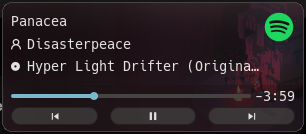

# media

The media module provides a single point of access to observe and control media
playback sources. Each playback source is individually observable and
controllable.

By default, this uses freedesktop.org's MPRIS via DBus, but it can be configured
to use any set of backends. If multiple backends are configured, additional
source information may be provided to coalesce multiple backend sources into a
single playback source, such as an application which supports both MPD and
MPRIS or if you are using an MPD to MPRIS bridge.

## Setup

The module should be initialized somewhere in your `rc.lua`.

Setup with default configuration, should work for most all cases out of the box.

```lua
require("continuity.media").setup()
```

Below is a full configuration with all defaults.

```lua
require("continuity.media").setup {
    backend = { -- Backends to use.
        require("continuity.media.backends.mpris")()
    },
    sources = {}, -- Source coalescing rules and additional source information.
    notifications = { -- Or false to disable notifications.
        notify_callback = nil, -- Custom notification handler. See notifications section.
        ---@type boolean|fun(): AwesomeClient[]
        suppress_when_client_active = true, -- Disable or customize client active suppression.
        ---@type boolean|'strict'
        intercept_dbus_notifications = true,
    },
}
```

Some backends cannot distinguish different the applications for which they emit
data for (MPD), while others can (MPRIS). If multiple backends are configured,
the `sources` option can be used to provide additional information to coalesce
multiple backend sources into a single playback source, such as an application
which supports both MPD and MPRIS. This allows the two backends to contribute to
a unified observable source and will expose the union of information from each
backends.

For playback and position capabilities, the backends array acts as a priority
list. The first backend with capability will be used for playback and position
capabilities for a source it is backing. For example, in the following
configuration, MPRIS will be used for playback and position capabilities for
the source `myplayer` if the MPRIS backend is registered to the source.

```lua
require("continuity.media").setup {
    backends = { -- In order of priority for playback and position capabilities.
        require("continuity.media.backends.mpris"){
            -- Map desktop-entry to MPRIS service name pattern.
            -- This can allow icon resolution for services that do not provide
            -- a desktop entry. Key should be desktop filename without extension.
            service_name_xdg_lookup = {
                -- Chrome has a bug and errors when requesting desktop entry.
                ["google-chrome"] = "^chromium%.instance.*",
                -- Luakit returns an empty string.
                luakit = "^org%.luakit%.Sandboxed%.instance-.*",
                -- Firefox works correctly, so this is just for completeness.
                firefox = "^firefox%.instance.*",
            }
        },
        -- Optionally label the MPD server for strict notification suppression.
        require("continuity.media.backends.mpd") { label = "myplayer" },
    },
    -- Coalesce the MPD and MPRIS sources for the same application into one
    -- unified source. 
    sources = {
        {
            id = "myplayer",
            name = "My Player",
            backends = { "mpris:myplayer", "mpd:127.0.0.1:6600" },
        },
    },
}
```

Or use an MPD to MPRIS bridge and just use MPRIS as the backend.

## Usage

### Observation

Note that the module provides a builtin notification handler which provides a
host of features. See the [Notifications](#notifications) section below for more
information. This is just a good example of how to use the module.

```lua
local media = require("continuity.media")
local naughty = require("naughty")

media.setup { notifications = false }

media.sources.on_updated(function(source)
    if source.state.status ~= "playing" or not source.state.title then
        return
    end
    naughty.notification {
        title = source.name,
        message = string.format("%s — %s",
            source.state.artist or "Unknown",
            source.state.title or "Unknown"),
    }
end)

-- Updated subscriptions may be debounced. This is useful to let a source settle
-- if data is streamed in or multiple backends are backing the source.
-- The subscriber will be notified once a source has stopped receiving updates
-- (excluding playback position) for the debounce period.
media.sources.on_updated(function(source) ... end, { debounce = 0.2 })
```

### Playback Position

Depending on the backend(s) backing a given source, the playback position may or
may not be updated regularly, which means `source.state.position` may not be
accurate at read time. To this end, position has an independent lifecycle. Pure
position updates do not update source update subscribers via either
`on_source_update` or `source:subscribe`. Instead, the `source.position`
handle may be used to request authoritative playback position.

`source.position:get` fetches the current playback position once
asynchronously, while `source.position:subscribe` informs the preferred
position capable backend to being observing playback position updates which will
be delivered to position subscribers.

```lua
---@type MediaSource
local my_source = ...

-- May or may not be up to date depending on the backend implementation.
my_source.state.position

-- Check that the source has a position capable backend backing it.
if my_source.position then
    -- Request the current playback position as a one shot authoritative answer.
    my_source.position:get(function(pos) ... end)

    -- Start listening for playback position updates.
    my_source.position:subscribe(function(pos) ... end)
end
```

### Playback Control

When a source has a playback capable backend backing it, playback control can be
obtained from `source.playback`. This will be `nil` when the source does not
have a playback capable backend backing it.

For convenience, the module direct controls for playback are available on the
`media` module. This target the most recently added source with playback
capabilities and an playback title.

```lua
local media = require("continuity.media")
local awful = require("awful")

-- Global keybindings acting on the most recently active source.
awful.keyboard.append_global_keybindings {
    awful.key({ "Mod4" }, "F9",  function() media.previous() end),
    awful.key({ "Mod4" }, "F10", function() media.play_pause() end),
    awful.key({ "Mod4" }, "F11", function() media.next() end),
}

-- Per-source control via the playback capability.
media.sources.on_added(function(source)
    if not source.playback then return end
    -- source.playback exposes: play, pause, play_pause, stop, next, previous,
    -- seek(offset_seconds), set_position(pos_seconds)
    source.playback:play_pause()
end)
```

## Notifications

If enabled (the default), the module will notify the user when a source changes
track or when its playback status changes between playing or not playing. The
default notification is a basic `naughty` notification with the art and title
and artist of the playback source.

A custom notification handler can be configured via the `notify_callback`
option allowing a fully customized notification such as embedding playback
controls or playback position display.

You can also manipulate media notifications. For example, if a custom UI popup
displays media information, maybe you want to disable media notifications while
the popup is visible. For instance, I do this when my custom volume menu is
open because it shows all active media sources within it.

```lua
local media = require("continuity.media")

-- Temporarily disable media notifications.
media.disable_notifications()

-- Destroy any existing notifications.
media.destroy_all_notifications()

-- Re-enable media notifications when the popup is closed.
media.enable_notifications()
```

### Art

When a backend emits a source with an `art_uri` that is not a local file, the
module will attempt to download the art to `~/.cache/awesome/media-art/`. This
local file URI is passed to the `notifications.notify_callback`.

### Client Focus

By default, notifications will not be emitted when the source application
(Awesome client) is visible on the focused screen. The suppression may be
disabled or customized via the `suppress_when_client_active` option.

```lua
require("continuity.media").setup {
    notifications = {
        -- Only suppress when the source application window has keyboard focus,
        -- rather than when it is visible on the focused screen.
        suppress_when_client_active = function()
            return client.focus and { client.focus } or {}
        end,
        -- Or completely disable it.
        -- suppress_when_client_active = false
    },
}
```

### DBUS Notification Interception

Some applications may emit freedesktop.org D-Bus notifications from their own
logic. By default, the module will intercept these notifications or replace
them with the module's own if they occur first.

The notification suppression can be disabled or customized via the
`notifications.intercept_dbus_notifications` option.

DBUS notification intercept modes:
- `true` (default): Suppress DBUS notifications that have a matching
  title to a notifying source.
- `false`: Do not suppress DBUS notifications.
- `"strict"`: Same as `true`, but will only suppress if DBUS source ID
  also matches or app name matches. Note that if the application uses a
  portal to send these notifications, the source ID will not match and there
  will be no appname, so the notification will not be suppressed.

### Examples

If your build of `awesome` supports `naughty.noficiation` API, then the
module will use `naughty.notification` to emit notifications. If the build of
`awesome` does not support `naughty.notification`, then the module will use
`naughty.notify`. If the former is available, this allows for completely
custom notifications via the `widget_template` arg, such as a seeking playback
position slider.

For example of what you can do, my media notification is as seen below.



Below is an example custom notification handler with playback controls via
actions and playback position display. Returning `nil` as the first value
will not notify, this can also choose not to notify based off custom user
logic.

```lua
local naughty = require("naughty")

local function format_time(seconds)
    local minutes = math.floor(seconds / 60)
    local seconds = math.floor(seconds % 60)
    return string.format("%2d:%02d", minutes, seconds)
end

require("continuity.media").setup {
    notifications = {
        notify_callback = function(source, art)
            local stop_pos, notification

            local title = source.state.title or "Unknown"
            local artist = source.state.artist or "Unknown"

            ---@param pos? number
            ---@return string
            local function message(pos)
                return table.concat(
                    pos and { title, artist, format_time(pos) }
                    or { title, artist },
                "\n")
            end

            ---@param pos? number
            local function update_message(pos)
                if not notification then return end
                notification.message = message(pos)
            end

            ---@param pb? Playback
            ---@return table[]
            function actions(pb)
                local actions = {}
                -- Check that the source has playback capability.
                if pb then
                    if pb.can_go_previous then
                        local prev = naughty.action({ name = "Previous" })
                        prev:connect_signal("invoked", function()
                            pb:previous()
                        end)
                        actions[#actions + 1] = prev
                    end
                    if pb.can_play and pb.can_pause then
                        local play_pause = naughty.action({ name = "Play/Pause" })
                        play_pause:connect_signal("invoked", function()
                            pb:play_pause()
                        end)
                        actions[#actions + 1] = play_pause
                    end
                    if pb.can_go_next then
                        local next = naughty.action({ name = "Next" })
                        next:connect_signal("invoked", function()
                            pb:next()
                        end)
                        actions[#actions + 1] = next
                    end
                end
                return actions
            end

            -- Check that the source has position capability.
            if source.position then
                -- Start listening for playback position updates.
                stop_pos = source.position:subscribe(update_message)
            end

            -- NaughtyNotificationArgs, MediaNotificationOptions
            -- It notification args is nil, then no notification will be created.
            -- Media notification opts is optional.
            return { -- naughty.notification or naught.notify args based on version.
                title = source.name,
                message = message(source.state.position),
                icon = art,
                timeout = 8,
                actions = actions(source.playback),
            }, { -- Additional options, may be omitted if not used.
                -- Set to a function to update the existing notification if it still
                -- exists instead of creating a new one on each notification event.
                -- Can also be set to true if the notification manages it's own lifecycle,
                -- EG via source:subscribe.
                reuse = function(source, art)
                    title = source.state.title or "Unknown"
                    artist = source.state.artist or "Unknown"
                    if notification then
                        notification.icon = art
                        notification.actions = actions(source.playback)
                    end
                    if source.position then
                        source.position:get(update_message)
                    else
                        update_message()
                    end
                end,
                -- Set to a function to run cleanup when the notification is dismissed.
                on_destroy = function()
                    if stop_pos then stop_pos() end
                end,
                -- If not using naughty.notification with a custom widget, this can be
                -- used to grab the notification reference to update it in-place.
                callback = function(notif)
                    notification = notif
                    if source.position then
                        -- Request the current playback position for immediate display.
                        source.position:get(update_message)
                    end
                end,
            }
        end,
    },
}
```

Note that a closure around a source is safe, as its members change but the
source reference will be persistent. `playback` and `position` should
always be referenced as a member of the source (`source.playback`) as if a
source gains or loses playback capability (extremely rare) or if the source is
coalesced and backing backends change, those may change to a new instance or
become `nil`. Although rare, a closure around `source.playback` or
`source.position` may become stale.

## Known Issues and Limitations

### MPD Playback Capabilities

MPD does not expose concepts of `can_play` like MPRIS. This means that playback
capabilities will always be observed as available for a source using MPD as its
playback capable backend.

## Known Bugs in Common Applications

This section contains known issues with common applications. These are not
bugs in this module and will **not** be worked around.

### Google Chrome

Google Chrome (at least stable on Linux) has several bugs in its MPRIS API.

#### Desktop Entry Discovery

Chrome throws an internal error when trying to fetch the desktop entry, so you
will see the following warning message in your logs:

```
media.mpris: dbus-send signal failed for /org/mpris/MediaPlayer2:org.freedesktop.DBus.Properties.Get@org.mpris.MediaPlayer2.chromium.instance17761 with contents [string:org.mpris.MediaPlayer2, string:DesktopEntry] (exit:1): Error org.freedesktop.DBus.Error.Failed: error occurred in Get
```

The module contains some workarounds to fallback to with icon discovery for
well known applications, so the icon **should** still resolve, but is not
guaranteed. This only affects app icon resolution.

#### Source Removal

Chrome fails to remove name owner from players when their tab is closed, so
sources may remain visible after closing the source tab. This is against the
MPRIS specification, and there is no semantically correct way to handle this
without an `if is_chrome` style escape hatch, so it is not accounted for.

#### Playback Sometimes Behaves Oddly

I have observed times where Chrome will stop doing certain things, specifically
pausing playback. Playing still works, as does playing via `PlayPause`, but
pausing does not via either `Pause` or `PlayPause` MPRIS methods. Nor do the
calls fail, they just do not do anything. This seems to be transient and is
simply a bug in Chrome, not this code.

### Firefox

#### Position Misreporting

I have observed in Firefox where the MPRIS reported playback position continues
to progress even when it is paused or stopped. If an MPRIS source misreports
its data, this module will observe it. Maintaining backend specific logic based
on last observed state (such as manually ignoring position changes in this case)
would be an anti-pattern.

### Spotify

#### Desktop Entry Discovery

At least the flatpak version of Spotify misreports its dekstop entry, returning
the regular `spotify` instead of the flatpak-specific `com.spotify.Client`.
This is a violation of the MPRIS spec and will result in the icon not being
discovered. This may be prevelent in other flatpaks as well.

```sh
$ dbus-send --session --print-reply \
    --dest=org.mpris.MediaPlayer2.spotify \
    /org/mpris/MediaPlayer2 \
    org.freedesktop.DBus.Properties.Get \
    string:org.mpris.MediaPlayer2 \
    string:DesktopEntry | grep "variant"
   variant       string "spotify"
```

The above `"spotify"` should be the below desktop file name, `"com.spotify.Client"`.

```sh
$ grep -Rin "^Name=Spotify" /home/quincyjo/.local/share/flatpak/exports/share/applications
/home/quincyjo/.local/share/flatpak/exports/share/applications/com.spotify.Client.desktop:3:Name=Spotify
```

#### Freedesktop Notifications

Spotify uses the portal to send freedesktop notifications. This means that they
have a different DBus sender than the MPRIS API and have no appname, so if the
module is not suppressing them (or you disabled dbus suppression or are using
`strict` suppression), check Spotify's settings to disable track change
notifications.
